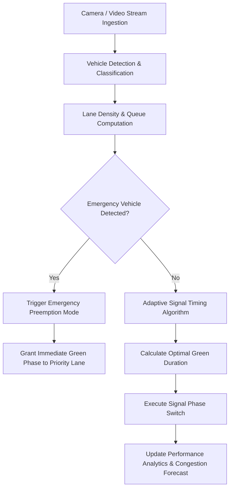

# 🚥 SmartSignal AI — Adaptive Traffic Signal Control & Congestion Prediction

**SmartSignal AI** is an advanced AI-powered traffic management platform engineered to optimize urban intersection traffic flow in real time. Moving beyond traditional fixed-timer signal schedules, SmartSignal AI dynamically measures vehicle density across multiple lanes, detects emergency vehicles for instant priority preemption, predicts imminent congestion bottlenecks, and continuously adapts signal timing parameters to minimize commuter delay and queue lengths.

---

## 🌟 Key Features

* **🚗 Real-Time Vehicle Detection & Density Analysis**
  * Multi-lane camera/video stream ingestion with vehicle classification (cars, buses, trucks, motorcycles).
  * Real-time calculation of lane density levels (`Low`, `Medium`, `High`, `Critical`).
  * Live visual feedback with bounding indicators and dynamic queue monitoring.

* **🧠 Dynamic Adaptive Signal Timing**
  * Automated calculation of green-light durations based on live lane occupancy and wait time dynamics.
  * Allocation of extended green phases to heavily congested corridors while maintaining safe minimum/maximum threshold bounds.
  * Smooth phase transitions with live countdown display and current phase indicators.

* **🚨 Emergency Vehicle Priority Preemption**
  * Automated detection of priority responders (ambulances, fire engines, police units).
  * Instant preemption logic that turns target lanes green and holds conflicting traffic safely.
  * Real-time audio-visual dashboard alerts during active emergency operations.

* **🔮 Predictive Congestion Intelligence**
  * Short-term forecasting engine evaluating historical patterns and real-time influx rates.
  * Proactive bottleneck warnings and signal timing recommendations before congestion cascades.

* **📊 AI vs. Fixed-Timer Simulation & Performance Analytics**
  * Built-in traffic flow simulator to compare adaptive AI control directly against traditional static signal schedules.
  * Key performance metrics tracking: **Average Waiting Time**, **Queue Length Reduction**, and **Throughput Efficiency**.
  * Dynamic charts powered by Recharts for time-series inspection and trend analysis.

* **⚙️ Admin & Intersection Management Controls**
  * Flexible lane configuration, minimum/maximum green threshold tuning, manual signal overrides, and historical reporting log session management.

---

## 🛠️ Technology Stack

| Category | Technologies |
| :--- | :--- |
| **Frontend Framework** | React 19, TanStack Start (SSR / File-based Routing), TypeScript |
| **Build & Tooling** | Vite 8, Tailwind CSS v4, PostCSS, ESLint |
| **UI Components & Icons** | Radix UI Primitives, Lucide React, Sonner Notifications |
| **Data Visualization** | Recharts, Tailwind Animate |
| **State & Data Handling** | React Hook Form, Zod Schema Validation, React Query |

---

## 📁 Project Structure

```
adaptive-lane-ai/
├── src/
│   ├── components/       # Reusable UI components & App Shell
│   │   ├── traffic/      # Signal controllers, lane cards, emergency alerts
│   │   └── ui/           # Radix UI primitives & theme providers
│   ├── hooks/            # Custom React hooks (traffic state, dark mode, telemetry)
│   ├── lib/              # Utility functions, algorithms & error reporting
│   ├── routes/           # TanStack Start file-based pages
│   │   ├── index.tsx     # Main Real-Time Traffic Dashboard
│   │   ├── analytics.tsx # Performance metrics & AI comparison charts
│   │   ├── simulation.tsx# Traffic flow simulator & strategy benchmark
│   │   ├── admin.tsx     # Intersection & signal threshold config
│   │   ├── reports.tsx   # System logs & session record export
│   │   └── __root.tsx    # Root layout & global context
│   └── styles.css        # Tailwind CSS import & custom theme variables
├── public/               # Static assets & favicon
├── vite.config.ts        # Vite configuration & TanStack plugins
├── tsconfig.json         # TypeScript compiler setup
└── package.json          # Package dependencies and npm scripts
```

---

## 🚀 Getting Started

### Prerequisites

* **Node.js**: v18.0.0 or higher
* **npm**: v9.0.0 or higher (or `bun` / `pnpm` / `yarn`)

### Installation & Local Setup

1. **Clone the repository**:
   ```bash
   git clone <repository-url>
   cd adaptive-lane-ai
   ```

2. **Install project dependencies**:
   ```bash
   npm install
   ```

3. **Start the local development server**:
   ```bash
   npm run dev
   ```

4. **Access the application**:
   Open your browser and navigate to `http://localhost:8080/` (or the port indicated in your console output).

---

## 📜 Available Scripts

| Command | Description |
| :--- | :--- |
| `npm run dev` | Launches the Vite development server with Hot Module Replacement (HMR). |
| `npm run build` | Compiles and builds the production distribution bundle. |
| `npm run preview` | Previews the production build locally. |
| `npm run lint` | Runs ESLint to check for code style issues and syntax errors. |
| `npm run format` | Runs Prettier to format source files. |

---

## 🚦 System Architecture & Logic Flow



---

## 📄 License

This project is open-source and available under the [MIT License](LICENSE).
